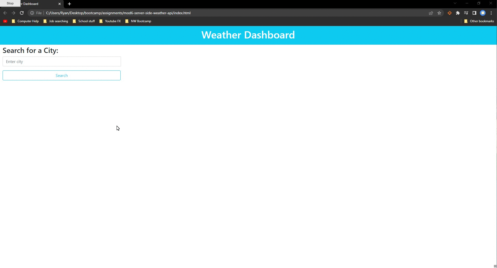

# Weather Dashboard
AS A traveler
I WANT to see the weather outlook for multiple cities
SO THAT I can plan a trip accordingly

## Module 6 Challenge Jan 11, 2023

* Deployed: https://ryebread5555.github.io/mod6-server-side-weather-api/
* GitHub: https://github.com/Ryebread5555/mod6-server-side-weather-api

## Acceptance Criteria
```
-GIVEN a weather dashboard with form inputs
-WHEN I search for a city
-THEN I am presented with current and future conditions for that city and that city is added to the search history
-WHEN I view current weather conditions for that city
-THEN I am presented with the city name, the date, an icon representation of weather conditions, the temperature, the humidity, and the the wind speed
-WHEN I view future weather conditions for that city
-THEN I am presented with a 5-day forecast that displays the date, an icon representation of weather conditions, the temperature, the wind speed, and the humidity
-WHEN I click on a city in the search history
-THEN I am again presented with current and future conditions for that city
```

## Function
- Weather dashboard has a search input that allows you to search for a city and displays the current weather as well as the 5 day fore-cast.
- Cities that have been searched are saved in the local storage and are displayed for the user to check each city they search for.
- Weather cards show images of how the weather is as well as tells you the degrees in fahrenheit.
- Temperture, wind speed, and humidity is also displayed.

## Languages
- HTML
- Bootstrap
- Openweather API

## Mock-up
